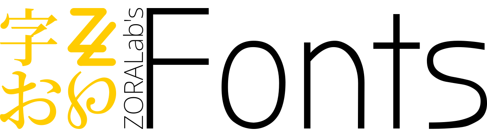

[](https://github.com/ZORALab/Fonts)

# ZORALab's Fonts
This fonts repository is the ZORALab's deployable fonts that are friendly for
public use with the following business goals:

1. **Making It Easy for Our Clients** - for modifications, deployment, and etc.
2. **Reusable Vetted Efforts** - vetted for
*Open Font Licenses stores with re-distributable license* for rapid prototyping.
3. **Easier to Scale Among ZORALab Members** - get to work without worrying
about glyphs and font availabilities.

> [!IMPORTANT]
>
> Due to ZORALab's cease of operations, this repository is no longer maintained
> and is transferred to [Holloway's Fonts](https://github.com/ChewKeanHo/LIBS_Fonts)
> for future development and maintenance.
>
> The repository is now archived. If you wish to use an updated and maintainable
> versions, please use the repository linked above.
>
> Thank you for patronizing.


## To Install

Simply `git clone` the repository to your operating system's fonts specific
folders and then execute the `update.sh.ps1` script is suffice. To roll in
updates, simply `git pull` and retry again.


### Linux & MacOS

The best location to house the font directory is the user-level font directory
or inside it. The location is:

```
${HOME}/.fonts
```

Hence, the usual commands are:

```
$ cd ~/.fonts
$ git clone https://github.com/ZORALab/Fonts.git zoralab
$ cd ./zoralab
$ ./update.sh.ps1
```

To update the repo from time to time, please enter the font repo and `git pull`:

```
$ cd ~/.fonts/zoralab && git pull
```


### Windows

Unlike Linux & MacOS, there is no specific location. Treat this repository like
any other source code repository.

The usual commands are:

```
$ git clone https://github.com/ZORALab/Fonts.git zoralab
$ cd .\zoralab
$ powershell.exe -noprofile -executionpolicy bypass -file .\update.sh.ps1
```

To update the repo from time to time, please enter the font repo and `git pull`:

```
$ cd .\zoralab
$ git pull
```


## To Use

Although the repository is set for automated font installation, there are some
basics you need to learn before selecting a font for an art deployment. Before
selecting a font for you next piece of art, you should always refer back to
the font origin here and study its intended design purpose for avoiding
akward outcome.


### Display Type

The `display` (`display/` directory) type fonts are usually
**designed for title and heading for attention grabbing**. They are not
suitable for paragraphing so you may want to avoid that kind of usage unless
otherwise specified by the designer.

In this repository, display type maintains the glyph spacing without going into
overly abstractive styling.


### Handwriting

The `handwriting` (`handwriting/` directory) type fonts are fancy & abstractive
handwriting **designed for passive art usage like background glyphs and etc**.
Obviously, they are way unsuitable for reading.


### Monospace

The `monospace` (`monospace/` directory) type fonts are **space aware glyphs
designed for plain and raw presentation (e.g. programming codes)**. It consumes
a lot of spacing and tends to be akwards when used at large like paragraphing.


### Sans Serif

The `Sans Serif` (`sans-serif/` directory) is a **modern organized font
without serif "tails"** (e.g. Those `Times New Roman` style) designed for
**both attention grabbing or conventional paragraphing**. Sans Serif
usually tends to **give modern, technological, and refreshing aura**.


### Serif

The `Serif` (`serif/` directory) is a **classical font with "tails"** similar to
`Times New Roman` kind of font **designed for both attention
grabbing or conventional paragraphing**. Unlike Sans Serif, Serif
**gives legacy and authoritive aura**.


### Scanner

The `Scanners` (`scanners/` directory) is a technologically functional font
**designed for specific functions like QR codes or Bar codes**. You should only
use the fonts here for technological function (usually comes with some kind of
scanner tool like Barcode scanner).


## Font Selection

The fonts are primarily selected based on the type of projects we engaged in.
Usually, the selected fonts are:

1. License complying to free (pricing and freedom) for both commerical and
   non-commerical use.
2. Lincese **MUST have unrestricted re-distributable rights as per se**.
3. Attributable to original authors.
4. Clear license file in case of legal dispute.
5. Suitable for most graphic design works.
6. Video processing (design and presentation).

Our documentations are primarily and strictly using Noto Family (sans, mono, and
serif). It is rare to see us use other fonts for work and coding purposes.


## Licensing
All sourced fonts **MUST** be licensed under the
[Open Font License](https://scripts.sil.org/cms/scripts/page.php?site_id=nrsi&id=OFL).
Otherwise, we do not have the permission to distribute and to re-distribute the
font freely under this repository.
