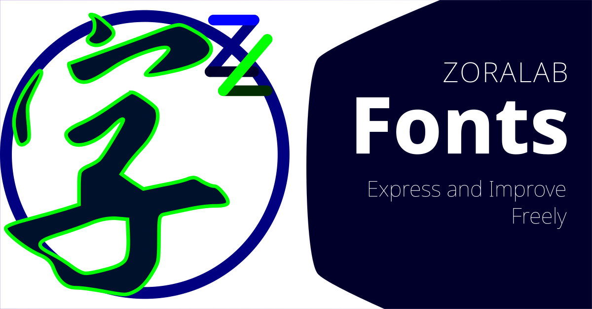

# ZORALab's Usable Fonts Repository
This ZORALab's Usable Fonts repository is for making it easy for our clients to
source the original materials used in our generated artworks or projects. These
fonts are selected in an opinionated and are **strictly selected from Open Font
Licensed stores with re-distributable license** like
[Google Font](https://fonts.google.com/).


## Why Such Repository
In short, we want a single common font library to ease our local and remote use
(rather than depending on single source of network as a primary supply chain).
Hence, instead of having everyone create their own set of fonts, we consolidate
them into a company-wide version, allowing everyone to have access to all fonts
used by the team or the client.

We tried to use the [Google Fonts](https://www.github.com/googlefonts/)
repository but ended up downloading a very large repo instead. Hence, that's
another reason for us to select required fonts from it.

Another good reason is anyone on Debian can just download the repository and
deploy easily into `$HOME/.fonts` directory and then execute:

```bash
$ fc-cache
```


## Selection of Fonts
The fonts are primarily selected based on the type of projects we engaged in.
Usually, the selected fonts are used for:

1. License compliances
  1. Free for commerical and non-commerical use.
  2. Re-distributable as per se.
  3. Attribution to original authors.
  4. Clear license file in case of legal dispute.
2. Graphic design work
  1. Used in any of our graphics project.
3. Video processing (design and presentation)
  1. Used in any of our videos project.

Our documentations are primarily and strictly using Noto Family (sans, mono, and
serif). It is rare to see us use other fonts for work and coding purposes.


## Licensing
All sourced fonts **MUST** be licensed under the
[Open Font License](https://scripts.sil.org/cms/scripts/page.php?site_id=nrsi&id=OFL).
Otherwise, we do not have the permission to distribute and to re-distribute the
font freely under this repository.
